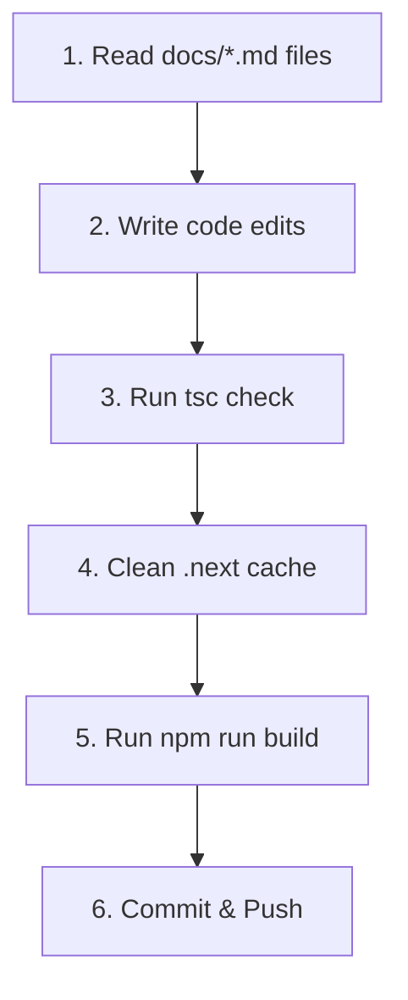

# 🤖 Agent Context & Master Guide

This file serves as the master instructions document and rules checklist for all AI coding agents and developers working on the **KrishokOS** repository.

---

## 📋 1. Project Overview & Philosophy

* **Project Name**: KrishokOS
* **Description**: A smart agriculture operating system and ERP for Bangladesh, focusing on GAP standards, residue-free crop planning, and export compliance.
* **Target Users**: Bangladeshi Farmers, Field Coordinators, and Export Compliance Auditors.
* **Current Phase**: Minimum Viable Product (MVP).

### Core Product Philosophy:
- **Simplicity First**: The MVP prioritizes simple, linear workflows over complex enterprise features. Users must be able to complete sign-up, configure a farm field, view fertilizer schedules, and track budgets in BDT without friction.
- **Bengali-First**: English-to-Bengali localization is a core product requirement. The default language is Bengali, and all actions must correspond to localized controls (e.g., **"শুরু করুন"** for starting, **"পরবর্তী ধাপ"** for next steps).

---

## 🗺️ 2. User Flows & Routing Rules

The application implements two entry pathways for onboarding:

### Flow A: Dashboard First
```text
Landing Page (/) 
  → Click Sign In/Up 
  → Credentials Form (/auth/signin) 
  → Redirect to Dashboard (/dashboard)
```
* **Behavior**: If the user has completed the wizard, the dashboard renders active farm stats (Bighas, active crop types). If the wizard is not completed, an amber warning card directs the user to `/plant-management` to start onboarding.

### Flow B: Farm Setup First
```text
Landing Page (/) 
  → Click "Farm Setup" 
  → Redirect to /auth/signin (if not logged in) 
  → Selection screen (/plant-management) 
  → 11-step Setup Wizard (/wizard) 
  → Redirect to Dashboard (/dashboard)
```
* **Behavior**: Pre-populates crop and method selections in the wizard. Completing Step 11 pushes data to the database, registers the farmer profile, and launches the dashboard.

---

## 🔐 3. Authentication & Authorization Rules

- **Auth Provider**: NextAuth.js Credentials Provider (managed in `lib/auth.ts` and `app/api/auth/[...nextauth]`).
- **Session Management**: Session tokens stored in standard JWT cookies. Layouts wrapped in `SessionProvider`.
- **Public Routes**: `/`, `/auth/signin`, `/auth/signup`, `/auth/verify-email`.
- **Protected Routes**: `/dashboard`, `/wizard`, `/farm-overview`, `/plant-management`, `/profile`.
- **Session Data Rule**: Each `Farmer` profile is tied to exactly one authenticated `User` account via a unique, typesafe `userId` foreign key.

---

## 🗄️ 4. Database Schema Rules

- **Database**: Supabase PostgreSQL.
- **ORM**: Prisma ORM (schema located in `prisma/schema.prisma`).
- **Data Models**:
  ```text
  User ── (has one) ── Farmer ── (has many) ── Farm
  ```
- **Session Tracker**: `WizardProgress` table stores steps, completed steps, and JSONB `stepData` form states.
- **Referential Integrity**: All relationships must enforce **Cascade Deletion** (`onDelete: Cascade`) to prevent orphaned user records.

---

## 💻 5. Coding & Tech Stack Rules

- **Frontend**: React 19, TypeScript, Tailwind CSS, ShadCN UI.
- **Backend**: Next.js 16 App Router API Routes.
- **ORM**: Prisma ORM v5.21.x (Do not upgrade to v7, which breaks inline database URLs).
- **TypeScript**: Strictly enforce `no-any`. All payloads must be declared with types or interfaces.
- **Visual System**: Green agricultural gradients (`from-green-600 via-emerald-600 to-teal-700`) and agricultural background variables (`#F8F8F4` light / `#081009` dark).

---

## 🛑 6. MVP Scope Constraints & Guardrails

**DO NOT IMPLEMENT** the following advanced features during the MVP phase:
- **AI Outbreak Prediction**: Visual leaf scanner tools or ML-based pest models.
- **IoT Sensors**: Moisture probes or automated drip-valve triggers.
- **Agribusiness Multi-Tenancy**: Organization workspaces with sub-accounts.
- **SMS/Voice Broadcasting**: Twilio or local cellular integrations.

*Alternative*: Use static dashboards, manual dropdown selections, and localized warnings.

---

## 🧠 7. Core Constraints & AI Behavioral Rules

To prevent regressions, the AI agent must strictly follow these rules:

1. **Strict Context Filtering**: Avoid cross-tenant data leaks. Every database query in handlers and controllers must explicitly filter records by the authenticated session user (`userId`).
2. **Hoisting Guardrails**: NextAuth configuration (`authOptions`) must be imported from `lib/auth.ts`, never declared directly inside the API route handler, to conform to Next.js route method constraints.
3. **URL Encoding**: Supabase passwords containing special characters (like `#`) must be URL-encoded as `%23` in `.env` database URLs.
4. **Maintain Comment Integrity**: Do not delete existing comments, translations tables, or documentation headers in files you edit.

---

## 🚦 8. Operational Workflow

Before completing your turn, follow this step-by-step pipeline:



### Stop & Wait for Human Approval:
The agent **must pause and request explicit approval** before executing:
1. Database Schema migrations or pushing new tables (`npx prisma db push`).
2. Adding or modifying NPM dependencies in `package.json`.
3. Commands deleting project data or database tables.

### Local Verification Verification Pipeline:
- **Type Checking**: `npx tsc --noEmit`
- **Clean Compilation**: `Remove-Item -Recurse -Force .next`
- **Build Compilation**: `npm run build`
