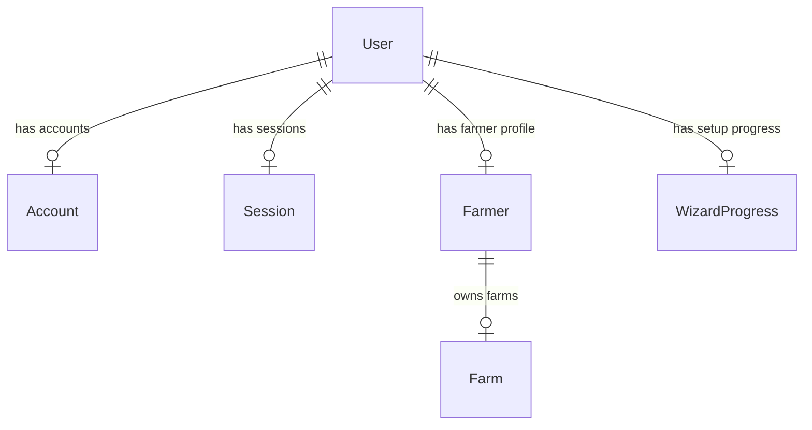

# 🗄️ Supabase PostgreSQL & Prisma Database Schema

This document details the active relational database schema, model definitions, foreign keys, and cascade-deletion rules configured in KrishokOS.

---

## 🗺️ Entity-Relationship Diagram (ERD)



---

## 📝 Schema Specifications (Prisma Schema Notation)

The database schema is defined in [schema.prisma](file:///f:/personal-projects/krishokos/prisma/schema.prisma) and synced directly with Supabase.

### 1. User & Account (NextAuth Core)
Stores user accounts, credentials, and session tokens.

```prisma
model User {
  id            String    @id @default(cuid())
  name          String?
  email         String?   @unique
  emailVerified DateTime?
  image         String?
  phone         String?
  passwordHash  String?
  createdAt     DateTime  @default(now())
  accounts      Account[]
  sessions      Session[]
  farmer        Farmer?
}
```

### 2. Farmer
Connects a standard user account to their agricultural profile.

```prisma
model Farmer {
  id         String   @id @default(cuid())
  userId     String   @unique
  fullName   String
  phone      String?
  email      String?
  nationalId String?
  createdAt  DateTime @default(now())
  updatedAt  DateTime @updatedAt
  user       User     @relation(fields: [userId], references: [id], onDelete: Cascade)
  farms      Farm[]
}
```

### 3. Farm
Represents a specific land plot under cultivation.

```prisma
model Farm {
  id             String   @id @default(cuid())
  farmerId       String
  farmName       String?
  farmType       String?   // e.g. "fruit", "grain"
  soilType       String?   // e.g. "clayey", "sandy", "loamy"
  waterSource    String?   // e.g. "groundwater", "river"
  district       String?   // e.g. "Bogura", "Narsingdi"
  upazila        String?
  union          String?
  areaSize       Float?    // Land size
  areaUnit       String?   // "bigha", "decimal", "katha"
  primaryCrop    String    // e.g. "banana", "papaya"
  farmingMethod  String    @default("organic") // "organic", "residue_free", "chemical"
  secondaryCrops String[]  // PostgreSQL Native Text Array
  annualBudget   Float?    // Expense tracking in BDT
  budgetCurrency String?   @default("BDT")
  createdAt      DateTime  @default(now())
  updatedAt      DateTime  @updatedAt
  farmer         Farmer    @relation(fields: [farmerId], references: [id], onDelete: Cascade)
}
```

### 4. WizardProgress
Stores step-by-step onboarding wizard forms, enabling save-and-resume.

```prisma
model WizardProgress {
  id             String    @id @default(cuid())
  farmerId       String?
  userId         String
  currentStep    Int       @default(1)
  completedSteps Int[]     // PostgreSQL Native Int Array
  stepData       Json      @default("{}") // Form answers (JSONB)
  resumeToken    String    @unique
  lastSavedAt    DateTime  @default(now())
  completedAt    DateTime?
  expiresAt      DateTime
}
```

---

## 🛡️ Referential Integrity & Cascade Deletion Rules

To keep the database clean and prevent orphaned records:
- **`User` $\rightarrow$ `Farmer`**: If a `User` account is deleted, the associated `Farmer` profile is deleted automatically (`onDelete: Cascade`).
- **`Farmer` $\rightarrow$ `Farm`**: If a `Farmer` is deleted, all owned `Farm` records are deleted automatically (`onDelete: Cascade`).
- **`User` $\rightarrow$ `Account`/`Session`**: Session rows are cleared instantly upon user removal.
