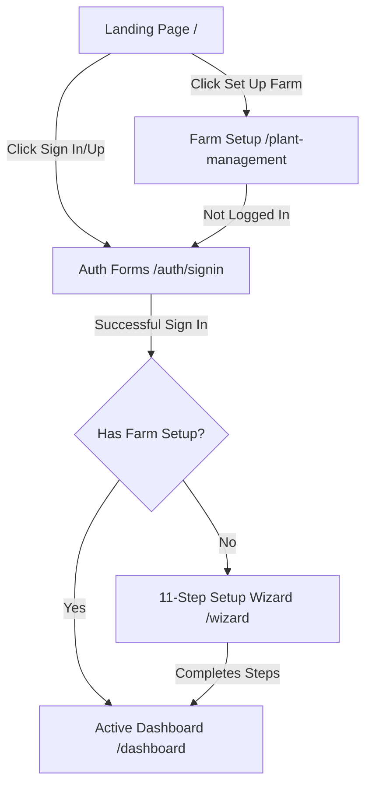

# 🗺️ KrishokOS - User Flow & Route Protection

This document outlines the step-by-step route transitions, page states, and middleware protections implemented in the KrishokOS application.

---

## 🚦 Route Protection & Middleware

All routes except for the landing page (`/`) and public auth assets (`/auth/*`) are protected. Authentication is managed via NextAuth.js.

### Unauthenticated Access Policy
If a guest user tries to access a protected route (e.g., `/dashboard`, `/wizard`, `/farm-overview`, `/api/wizard/*`):
1. The request is intercepted by NextAuth.js middleware or server-side session checks.
2. The user is redirected to `/auth/signin`.
3. If redirected from a specific page, that page URL is passed as a `callbackUrl` parameter so they are returned to their destination immediately after logging in.

---

## 🔄 User Flow Diagram & Lifecycles

---

## 👥 Flow Details

### Flow A: Dashboard First
This flow describes a user navigating straight to their account.

1. **Entry**: User lands on the marketing Landing Page (`/`) and clicks "Dashboard" or "Sign In".
2. **Authentication**: User is routed to `/auth/signin` (or `/auth/signup`). They complete credentials validation.
3. **Redirect**: After successful authentication, they are redirected to `/dashboard`.
4. **State Check (Prisma Evaluation)**:
   - The dashboard route handler queries the `Farmer` model associated with the active session user ID.
   - **Case 1: No Farmer Profile**: The dashboard displays a prominent amber warning card: *"Farm Setup Not Complete. Please complete your 11-step farm profile setup to activate AI disease detection..."* with a button linking to `/plant-management`.
   - **Case 2: Farmer Profile Active**: The dashboard renders personalized statistics (active farm count, bighas/decimals under cultivation, crop lists, compliance alerts) and crop overview links.

---

### Flow B: Farm Setup First
This flow describes a user starting directly with crop cultivation.

1. **Entry**: User lands on the marketing Landing Page (`/`) and clicks "Farm Setup" or a specific crop card (e.g., Papaya or Banana).
2. **Crop & Method Selection**: User is routed to `/plant-management` (protected). If unauthenticated, they are redirected to `/auth/signin` first, then returned to `/plant-management`.
3. **Selection Submission**:
   - The user selects a primary crop (e.g., **Banana** or **Papaya**) and a farming method (e.g., **Organic**, **Residue-Free**, or **Chemical**).
   - Clicking "Next" posts this choice to `/api/wizard/start` and redirects the user to `/wizard`.
4. **11-Step Wizard Onboarding**:
   - The user progresses step-by-step through the forms:
     - *Step 1*: Farmer Name, Phone, NID.
     - *Step 2*: Farm Name & Type (pre-populated from `/plant-management`).
     - *Step 3*: Soil & Water diagnostics.
     - *Step 4–6*: Location Dropdowns (District → Upazila → Union).
     - *Step 7*: Land Area Size & Unit.
     - *Step 8–9*: Crop Details.
     - *Step 10*: Budget details.
     - *Step 11*: Review all fields.
5. **Completion**: Clicking "Submit" posts to `/api/wizard/complete`, creates the `Farmer` and `Farm` records in the database, and redirects them to `/dashboard` with their newly active farm profile.
